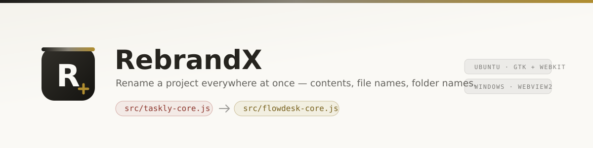

<p align="center">
  
</p>

<h1 align="center">RebrandX</h1>

<p align="center">
  <b>Rename an entire project without hunting through it by hand.</b><br>
  Files · folders · source contents · repo references
</p>

<p align="center">
  Ubuntu &nbsp;•&nbsp; Windows &nbsp;•&nbsp; Desktop + CLI
</p>

---

## What is RebrandX?

RebrandX takes an existing project name and replaces it across the entire project:

* **File contents**
* **File names**
* **Folder names**
* **Case variants**
* **Repository references**

Before anything is changed, RebrandX shows you exactly what it found and lets you review the result.

Skip entire files, individual lines, or run the whole operation as a dry run.

> **Nothing is written until you approve it.**

---

## Why?

Renaming a project sounds simple until the old name exists in:

```text
Taskly/
├── src/taskly/
├── taskly.config.json
├── README.md
├── package.json
├── .github/
└── hundreds of source files
```

RebrandX handles the rename as one operation.

```text
Taskly  →  Flowdesk
taskly  →  flowdesk
TASKLY  →  FLOWDESK
```

Including paths and contents.

---

## Features

### 🔎 Preview everything

Scan the project before touching it.

RebrandX shows:

* every affected file
* every path rename
* change counts
* line-by-line diffs

Individual files and changed lines can be excluded before applying.

### 🔤 Case-aware replacement

One rule can automatically handle common variants:

```text
taskly  → flowdesk
Taskly  → Flowdesk
TASKLY  → FLOWDESK
```

Or switch to exact matching, case-insensitive replacement, or regex.

### 📁 Rename paths too

RebrandX doesn't stop at file contents.

```text
taskly.config.json
↓
flowdesk.config.json
```

Folders are renamed as well.

### 🧹 Clean old project metadata

Optionally remove project-specific files from the original repository:

```text
.github/
.gitlab/
LICENSE
CHANGELOG
CONTRIBUTING
CODE_OF_CONDUCT
SECURITY
AUTHORS
FUNDING.yml
```

The list is customizable.

Your source, README and package metadata remain available for normal rebranding.

### ↩ Safe in-place mode

Modify the existing project while keeping a backup in:

```text
.rebrandx-backup/
```

Use **Revert** to restore the previous state.

### 📋 Copy mode

Prefer not to touch the original?

Create a completely rebranded copy in another directory.

Ignored paths such as `.git/` and `node_modules/` can be excluded automatically.

### 🖥 Desktop + CLI

The same engine powers:

* Linux desktop app
* Windows desktop app
* `rbx` command-line interface

---

# Desktop App

The interface uses a simple three-column workflow:

| Rules               | Files                 | Diff                   |
| ------------------- | --------------------- | ---------------------- |
| Define what changes | Review affected files | Inspect actual changes |

### Rules

Configure:

* find + replace
* case variants
* file/folder renaming
* content replacement
* regex
* repository cleanup
* ignore rules
* dry-run mode

### Files

See every affected file and its resulting name.

Skip anything that should remain untouched.

### Diff

Inspect the exact before/after result.

Individual changed lines can be excluded before applying the rebrand.

---

## Getting it

On Windows there is nothing to install — build or download the `.exe` and run it. Ubuntu has the usual packaging, since that is what a Linux desktop expects.

### Ubuntu

#### `.deb` package

```bash
cd ~/.local/share/rebrandx
./linux/build-deb.sh

sudo apt install ~/.local/share/rebrandx/dist/linux/rebrandx_1.2.0_all.deb
```

This installs both:

```text
rebrandx
rbx
```

and registers RebrandX with GNOME.

#### Local install

No sudo:

```bash
./linux/install.sh
```

Optional:

```bash
./linux/install.sh --no-desktop-icon
```

Remove later with:

```bash
./linux/uninstall.sh
```

### Linux requirements

```bash
sudo apt install python3-gi gir1.2-gtk-3.0 gir1.2-webkit2-4.1
```

RebrandX uses the system GTK stack and does not require a Python package environment for the Linux desktop build.

See [`linux/README.md`](linux/README.md) for the Linux side in detail — what each script does, and the tkinter fallback when the GTK bindings are missing.

---

### Windows

RebrandX on Windows is a **portable app**. There is no installer, no setup, no registry keys and nothing in Program Files: one `.exe` that you keep wherever you like and delete when you are done with it.

#### The .exe

```powershell
powershell -ExecutionPolicy Bypass -File windows\build.ps1
```

Produces two self-contained files that need no Python and no install step:

```text
dist\windows\RebrandX.exe          the app — double-click it
dist\windows\rbx.exe               the command line — and the app, double-clicked
dist\windows\RebrandX-windows.zip  both, ready to hand to someone
```

Put either one on a USB stick, in `C:\Tools`, on your Desktop — anywhere. Every release also ships them as build artifacts, so you can skip the build entirely and just download the file.

Either file works on its own. `rbx.exe` prints and waits like a normal
command when you give it arguments, opens the window when you double-click
it or run it bare, and opens the window on a folder you drop onto it — no
terminal appears in either of those cases. To see what a copy of it is made
of:

```powershell
dist\windows\rbx.exe --self-test
```

Want it on your PATH or in the Start menu? Move the `.exe` into a folder that is already on your PATH, or right-click it → **Pin to Start**. Windows does that part; RebrandX does not need to write to your registry to arrange it.

#### Run from source

Needs [Python 3.8+](https://www.python.org/downloads/) — and nothing else. The window is built on tkinter, which ships with Python, so there is no runtime, no browser engine and nothing to `pip install`.

```powershell
python rebrandx\app_tk.py
```

Or double-click `windows\bin\rebrandx.bat`; for the command line, `windows\bin\rbx.bat`.

See [`windows/README.md`](windows/README.md) for Windows-specific behaviour — NTFS case-only renames, long paths, invalid filenames, encodings and read-only files.

---

# Command Line

Basic usage:

```bash
rbx OLD_NAME NEW_NAME PATH
```

Example:

```bash
rbx Taskly Flowdesk ~/dev/taskly
```

### Preview only

```bash
rbx Taskly Flowdesk ~/dev/taskly -n
```

### Create a renamed copy

```bash
rbx Taskly Flowdesk ~/dev/taskly --into ~/dev/flowdesk
```

### Clean old project metadata

```bash
rbx Taskly Flowdesk ~/dev/taskly --clean
```

### Multiple directories

```bash
rbx Taskly Flowdesk ./a ./b ./c
```

Running `rbx` without arguments opens the desktop application.

---

## CLI Options

| Option                 | Purpose                                 |
| ---------------------- | --------------------------------------- |
| `-n`, `--dry-run`      | Preview without writing                 |
| `-y`, `--yes`          | Skip confirmation                       |
| `-i`, `--ignore-case`  | Match regardless of casing              |
| `-V`, `--no-variants`  | Disable automatic case variants         |
| `-e`, `--regex`        | Treat the find value as regex           |
| `--into DEST`          | Write to a new directory                |
| `--strip-repo`         | Remove references to the old repository |
| `--clean`              | Remove old project metadata files       |
| `--ignore GLOB`        | Add an ignore pattern                   |
| `--no-default-ignores` | Include normally ignored paths          |
| `--no-rename`          | Change contents only                    |
| `--no-contents`        | Rename paths only                       |
| `--no-backup`          | Disable in-place backup                 |
| `-v`                   | Show every changed file                 |
| `--revert PATH`        | Restore an in-place backup              |

---

# Safety

RebrandX is intentionally conservative.

### Binary files are not edited

Files containing binary data or invalid UTF-8 are left untouched internally, although their filenames can still be renamed.

### Encoding is preserved

RebrandX preserves:

* CRLF / LF line endings
* existing encoding behavior
* trailing-newline state

### Renames happen deepest-first

Nested folders are renamed safely before their parents.

Name collisions receive a suffix rather than overwriting another file.

### Symlinks are skipped

A symlink cannot cause RebrandX to modify content outside the selected project tree.

### Dangerous roots are blocked

RebrandX refuses to operate on locations such as:

```text
/
/usr
$HOME
```

and similar high-risk directories.

---

# Architecture

One app, two platforms. The engine is shared; the window and the packaging
are not, and the repo says so out loud — everything Linux-only lives in
`linux/`, everything Windows-only in `windows/`, and each builds into its
own half of `dist/`.

```text
rebrandx/           the app — shared by both platforms
├── engine.py       the rebrand engine
├── core.py         shared application logic
├── cli.py          the rbx command line
├── win.py          Windows filesystem + console primitives
├── app_gtk.py      the GTK window          ─┐ Linux
├── ui_gtk/         its HTML/CSS/JS assets  ─┘
├── app_tk.py       the native window       ─┐ Windows
├── widgets.py      the drawn controls       │ (and the Linux fallback
├── theme.py        palette and ttk styling  │  when GTK is missing)
├── anim.py         easing and timers        │
└── splash.py       the launch screen       ─┘

linux/              Linux only
├── build-deb.sh    → dist/linux/rebrandx_1.2.0_all.deb
├── install.sh      wire the checkout into GNOME
├── uninstall.sh    take it back out
└── bin/            rbx, rebrandx

windows/            Windows only
├── build.ps1       → dist/windows/RebrandX.exe, rbx.exe, the portable zip
├── build-under-wine.sh   the same build, driven from a Linux box
└── bin/            rbx.bat, rebrandx.bat

dist/linux/         the .deb
dist/windows/       the .exe files and the portable zip
tools/              make-icon.py — regenerates the icon set from the SVG
tests/              engine and GUI tests, both platforms
share/              icons and branding
```

Picking this up cold, or coming back to it later? [`docs/HANDOFF.md`](docs/HANDOFF.md) is the state of the project and the reasoning behind the decisions that look arbitrary from outside.

Each platform folder has its own README:
[`linux/README.md`](linux/README.md) and
[`windows/README.md`](windows/README.md).

The `rebrandx/` package deliberately is **not** split by platform. The
engine, the safety rules, the encoding handling and the CLI are one
codebase — forking them per OS would mean fixing every bug twice. Only the
window differs, and the two windows sit next to each other under names that
say which is which.

The architecture intentionally keeps the rename engine separate from the interface.

```text
             ┌─────────────┐
             │   engine.py │
             └──────┬──────┘
                    │
                ┌───▼───┐
                │ core.py│
                └───┬───┘
                    │
        ┌───────────┼───────────┐
        ▼           ▼           ▼
     Windows      Linux         CLI
      tkinter      GTK          rbx
     (stdlib)
```

`engine.py` uses only the Python standard library and has no dependency on a GUI toolkit.

---

# Tests

Run the engine test suite:

```bash
python3 tests/test_engine.py
```

The suite currently covers **35 checks**, including:

* replacement rules
* scanning
* in-place operations
* copy mode
* backups and revert
* nested renames
* project-file cleanup
* Windows filename handling

Windows behaviour has its own suite:

```bash
python tests/test_windows.py
```

89 checks covering illegal filenames, drive-root guards, encodings and
BOMs, line endings, read-only files, junctions, long paths, case-only
renames and the desktop window itself.

GUI probes drive the real interfaces and report what they painted:

```bash
python tests/gui_probe_tk.py        # the native window
python tests/gui_probe_tk.py --shot window.png
python3 tests/gui_probe.py          # the Linux GTK shell
```

---

## Keyboard Shortcuts

| Shortcut       | Action        |
| -------------- | ------------- |
| `Ctrl + O`     | Open folder   |
| `Ctrl + Enter` | Apply rebrand |
| `Esc`          | Close dialog  |
| `Ctrl + Q`     | Quit          |

---

## Built With

* Python — standard library only
* tkinter for the native desktop window
* GTK 3 / WebKitGTK for the Linux shell

The Windows app has **no third-party dependencies at all**. Every interface shares the same underlying RebrandX engine.

---

<p align="center">
  <b>Rebrand the project — not your afternoon.</b>
</p>
